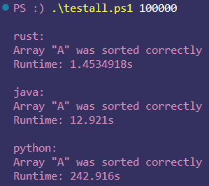

<!-- Ctrl-Shift-V for editor preview -->

# Insertion Sort Notes

[Python](#python) | [Java](#java) | [Rust](#rust) | [Update 11/8/23](#update-11823) | [Update 11/11/23](#update-111123)

`buildall.ps1` will compile the Java and Rust binaries, and `runall.ps1` will run examples of all 3 programs. `testall.ps1` will run a test for each, with runtimes.

## [Python](./python/insertion_sort.py)
Implementing this algorithm in python was pretty simple, the only struggle I really had was reasoning how to number the indexes for the for loop compared to the algorithm in the book (arrays start at 1 and go to n in the book, python is of course 0 to n-1). However, that didn't take long to figure out. Coding in python is pretty nice. Even if I have to look a couple things up, it doesn't take long to write. [🪶](#insertion-sort-notes)

## [Java](./java/insertion_sort.java)
Implementing this in Java was pretty difficult, mostly since I'm still learning Java. The main issue I had was confusion about copying an array. At first I intended to have the `sort()` function return the sorted array and assign that array to a new array. However, upon doing so I found that the original array `A` would be sorted as well. I still don't fully understand it, but the `sort()` function changes `A`. I then tried to copy `A` to a new array and then sort it, but `A` still ended up getting sorted. As I understand it now, arrays are objects, and the variable assigned to an array is actually a pointer to this object (the same thing happens for classes). When I set the new array equal to `A`, I'm just pointing to the same array. As for why the `sort()` method alters `A`, I think its because by using `A` as the input of the method, acting on `A`, and returning `A`, I'm actualling acting on that same pointer. This threw me off compared to something like what I'd find in python where the scope of the method is different and as such its essentially a different variable. 

My first solution was to just print the original array, sort `A` (with `sort()` now returning void), and then print the sorted array. This works, but its not what I wanted to do. In the end, I had the `sort()` method use `clone()` to clone the original array.

Also, for printing the arrays, I originally use a while and for loop to do it:

```java
int i = 0;
String version = "Original: [";
while(i < 2) {
    System.out.print(version);
    for(int j = 0; j < A.length; j++) {
        if(j < A.length-1){
            System.out.print(A[j] + ",");
        } else {
            System.out.print(A[j]);
        }
    }
    System.out.print("]\n");
    sort(A);
    version = "  Sorted: [";
    i ++;
}
```

This works just fine, but `Array.toString()` works much better. [🪶](#insertion-sort-notes)

## [Rust](./rust/src/main.rs)
Rust has taken the most time and effort to implement because I have no prior experience with it whatsoever and learning the fundamentals has been more of an undertaking compared to any other language I've learned. It seems like Rust is very controlled language, and some of the concepts in Rust took me a bit to understand (and I don't fully understand them all yet), e.g. variable types, mutability, ownership, etc. However, the [Rust book](https://doc.rust-lang.org/stable/book/) has been an incredibly useful resource for learning, and it's been very helpful in convincing me of why one might want to use Rust. It's an interesting language and I'm having fun learning it.

For the rust implementation of the insertion sort algorithm, there were a few things that really tripped me up. First of all, the `rand` crate (i.e. library or package as it's called in other languages) was a bit confusing to figure out for generating a vector of random integers. At first I tried using arrays, but learned about vectors instead and found it easier to accomplish with vectors. In fact, the book said that, when in doubt, use vectors instead. As I understand it, in Rust, vectors are stored on the heap, and arrays are stored on the stack in memory. That fact is more important with objects whose length changes dynamically, which wasn't really important here. In the end, I opted to write a function to output a random vector of length `N`:

```rust
fn gen_rand_arr<const N: usize>() -> Vec<i32> {
    let mut rng = rand::thread_rng();
    (0..N).map(|_| rng.gen_range(0..100)).collect()
}
```

At this point I more or less understand what's going on here, but the "<>" thing between the function name and the argument parentheses still confuses me. At least I know it has something to do with "generics" in Rust, but that's something I still need to learn more about. 

The other thing that really tripped me up was the indexing for the loops in the insertion sort algorithm. I got it to work, but I'm not sure whether my solution is a proper one or not. The crux of the issues stems from the fact that the index for the for loop must be a `usize` type (i.e. a type of unsigned integer), but with 0-indexing for arrays/vectors, and the way insertion sort is written, `j` would end up needing to take a value of `-1`, at least in the way I've been writing it. I found workarounds most of the time (`j as usize` would convert from `int32` to `usize` when necessary), but really ran into problems in the conditions on the while loop. While one condition would be `j >= 0` (again, 0-indexing, allowing `j` to be `0`), the other would use `j` to access the vector being sorted. Translating from `j = -1int32` to `usize` would result in an overflow, making `i = 18446744073709551615`. To solve this issue, I realized I could make the `A[j] > key` condition conditional on whether `j` was positive or not:

```rust
while (j >= 0) & (if j >= 0 {a[j as usize] > key} else {false}) {...}
```

I found this pretty neat as a solution to this issue. I would still like to see if there are other ways to write this part though. [🪶](#insertion-sort-notes)


#### Update (11/8/23)
Turns out the above was unnecessary. The operator `&` I used is the *non*-short circuiting kind. `&&` short ciruits (i.e. if the first arg of `&&` is `false`, then it doesn't evaluate the second, which is useful here). Not sure why when I looked up "rust and operator" the first one I got was `&`, because it seems like the more widely used one is `&&`. Anyways, now the while can just be written:

```rust
while (j >= 0) && (a[j as usize] > key) {...}
```

Good to know! [🪶](#insertion-sort-notes)

#### Update (11/11/23)
I decided to implement a better way of testing each of the implementations of insertion sort. For each I'm adding the ability to optionally read in two files on the command line so that the programs can sort a file and check if it is correctly sorted. The unsorted and correctly sorted files are in the "testing" directory, "A.txt" and "A_sorted.txt". These can be created using the "make_random.py" on the command line, e.g. `.\...\testing\make_random.py N <output-path>` where N is the number of random items in A. Alternatively, the `testall.ps1` script accepts 1 argument `N` and will automatically run the Python, Java, and Rust programs with these inputs, and for each confirming that the output is correct, along with the runtime of the algorithm (this is done internally in each program). Java is not yet implemented, but it is for Python and Rust.

Once again, this was very easy to implement in Python, but it was very difficult in Rust. It took about two days, but eventually I was able to figure it out (with a lot of research and reading of the Rust book). Parsing arguments in Rust is pretty simple.

```rust
use std::env

fn main() {
    let mut args: Vec<String> = env::args().collect()
    args.remove(0)
}
```

Here, `env::args()` returns an iterator over the args (with the Args trait), and `collect()` converts the iterator into a vector. I let it be mutable so that I can remove the first argument, which is just the path for the current directory.

Next is where it got *very* tricky. Based on whether the program takes in arguments or not, I want two different things to happen. I could handle this in a different way that is more rigid, but I wanted to take on the challenge. I won't go into the details now because it's way too much, but learned about enums, `match`, and the `Optional` type. The `Optional` type specifically came in handy here. Long story short, in my code I may or may not have `a_correct`, so I needed a way to represent this fact. `Optional` does this! If you're reading this, I encourage you to look at the code from lines 37 to 56 (starting with `let (a, a_correct)`). That section took me hours to write, but I learned a TON from doing it.

Also, I learned that anything that happens in and if-else statement, e.g. variable declarations, are destroyed once you leave the scope of the if-else statement. This threw me off at first because I'm not used to this behavior. However, I found out you can just return values from if-else statments. For example:

```rust
let x = if condition {
    value1
} else {
    value2
}
```
I.e., if `condition` is true, `x = value1`, else `x = value2`. Nothing too huge, but I thought this was pretty neat. Given Rust's general philosophy towards programming, this behavior makes a lot of sense. [🪶](#insertion-sort-notes)

#### Update (11/13/23)
Finally finished implementing testing I/O in Java that I had done in Python and Rust. I think I've started to get a better feel for how Java works and felt pretty comfortable while writing the code for it. That said, there were a few difficulties I ran into, but using Google and the Java documentation, I was able to figure it out.

To store the input array, I couldn't use an `Array` object like I had before, since those arrays are static (in memory, i.e. on the stack), but reading in a file I wouldn't know what size my array needs to be before I run the program. `java.util.ArrayList` is a dynamic array object, and is what I needed to use here. I had to make slight edits to my `insertion_sort` method, but this just involved using `set` and `get` methods to fetch and update my array, so it wasn't a big difference.

To read in the arrays, I wrote the `ArrGet` method, which was helpful since I need to go through this process twice. I'm now realizing though that this may have been helpful in my Rust implementation of this, but I'll leave it as-is.

One peculiarity I ran into for Java when reading in an array is that in the `A.txt` file, the last line is empty based on how I wrote the code in Python. I noticed this before, but haven't had any issue with it in my Python and Rust implementations. Here, `nextInt()` cannot handle an empty line. To solve this, a simple try-catch can be used to catch the error and just ignore it. 

```java
try {
    step = reader.nextInt();
} catch (NoSuchElementException e) {
    continue;
}
```
Now, I'm wondering what Python and Rust are doing with that empty line. As a solution to that, I"ll just change the code that generates `A.txt` and `A_sorted.txt`.

Finally, with everything implemented, we can test to see how fast each algorithm sorts an array of 100,000 randomly generated integers. To do this, from the [insertion_sort](.) directory, we run (on Windows, in powershell):

```powershell
PS :) .\buildall.ps1
PS :) .\testall.ps1 100000
```

Which gives the following output:

<picture>  </picture>

(We could run this multiple times to get an average runtime, but this should be good enough to get a rough idea of how long each takes.) As expected, Rust was fasted, taking about 1.5 seconds. Java came in second at about 13 seconds, and then Python, at 243 seconds, 162 times slower than Rust! These results aren't really all that surprising given what each of these languages are. I did expect Java to be closer to Rust in runtime, but I suspect the way I read in the file in Rust was much faster than what I did in Java ([built-in functions](./rust/src/main.rs#L38) vs. a [while-loop](./java/insertion_sort.java#L23) to read line-by-line), so I will need to look into that. 

It's worth noting that I tested how long the native `sort()` method takes in Python, and it is faster than the time I got for Rust (after all, that's how `A_sorted.txt` is made in the [make_random.py](./testing/make_random.py#L39) file), but that method is written in C and uses a more optimized algorithm for sorting (called timsort, or something).

One final note: I should include bash scripts to for "buildall" and "testall", and I probably won't include a "runall" in future algorithm implementations. 🪶