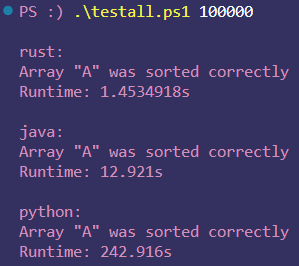

# Merge Sort Notes

[*Jump to Runtime Testing*](#results)

## [Python](./python/merge_sort.py)
Nothing much to write about here for this implementation. Used the xor-operator "`^`" for the first time, and I finally learned what "`*args`" and "`**kwargs`" means. Those are pretty handy. I used these to build a function to time the execution of a function in the function "`timeit`". Turns out this is already a Python package, but this works well enough.

## [Java](./java/merge_sort.java)
Not much different from the implementation of insertion sort. For timing the merge sort function call, I decided to build a method that will format the results so its in milliseconds or seconds: whichever is more natural. 

I did switch from using the `Scanner` object for file I/O and instead used the `BufferedReader` object, which allowed for files to be read more efficiently. As I understand it, using buffers when reading/writing from/to files reduces overhead by limiting the number of system calls. For very large files this can be an improvement, although I'm not sure that with the file sizes I'm working with it makes much of a difference. Regardless, it's good to know.

## [Rust](./rust/src/main.rs)
Again, nothing much different from insertion sort. The one thing that was interesting was that the compiler flagged me for writing a recursive function that had no way of exiting. I originally wrote the `merge_sort` function without first checking that `i` $\neq$ `j`. When I did this, the compiler gave an error (or warning) that the recursion could not cease. This is another example of what I find so fascinating about Rust. It really does its best to make you not make mistakes.

I ended up re-writing the Python scripts that created the random arrays for testing in Rust because I wanted to make arrays that were 10s-of-millions large, and Python was too slow (at least in the way I implemented it). Rust, however, is much, *much* faster for this task. This is a good example of why Rust is a good language to learn in complement to a language like Python. 

To create the random arrays for sorting, run (from the appropriate directory):

```
.\<path to>\make_random.exe <array size> <output path>
```

or, for example, from the `merge_sort` directory:

```
.\testing\make_random.exe 1000000 .\testing\
```

which will create an array and a sorted array of 1 million integers from 0 to 999,999. 

Because I didn't include the `make_random.rs` in the repo, I'll put the code for it here and discuss a couple things about it. (Forgive me for the line numbers being part of the text, apparently GitHub has no built-in method to show line numbers on code.)

```rust
 1  use std::env;
 2  use std::fs::File;
 3  use std::io::{Write, BufWriter};
 4  use rand::Rng;
 5  use rand::rngs::ThreadRng;
 6   
 7   fn main() {
 8      let argv: Vec<String> = env::args().collect();
 9
10      let n: usize = argv[1]
11          .parse::<usize>()
12          .unwrap();
13
14      let file_path = &argv[2];
15      
16      let m = (n-1) as i32;
17
18      let mut rng: ThreadRng = rand::thread_rng();
19
20      let mut a: Vec<i32> = vec![0; n]
21          .into_iter()
22          .map(|_| rng.gen_range(0..m))
23          .collect();
24
25      let a_file = File::create(format!("{}{}", file_path, "A.txt"))
26          .expect("file create failure");
27        
28      let mut buf_writer = BufWriter::new(a_file);
29
30      for i in 0..a.len() {
31          if i < a.len()-1 {
32              writeln!(buf_writer, "{}", a[i]).expect("write error")
33          } else {
34              write!(buf_writer, "{}", a[i]).expect("write error")
35          };
36      }
37
38      a.sort();
39
40      let a_sorted_file = File::create(format!("{}{}", file_path, "A_sorted.txt"))
41          .expect("file create failure");
42      
43      let mut buf_writer = BufWriter::new(a_sorted_file);
44
45      for i in 0..a.len() {
46          if i < a.len()-1 {
47              writeln!(buf_writer, "{}", a[i]).expect("write error");
48          } else {
49              write!(buf_writer, "{}", a[i]).expect("write error");            
50          }
51      }
52  }
```

Like with Java, here I used buffered file I/O via `BufWriter`, although I'm not sure how this differs from how I read in files in the Rust implementation of merge sort. Interestingly (to me at least), using a for-loop to write each line is a good way of doing this, which makes sense considering the actual output won't get flushed to the file until the buffer is full. At first I tried to make an iterator over the vector whose contents I wanted to write, but I couldn't get this to work (or it just doesn't work, I don't know). I still would like to find a better way to handle not writing the newline character on the last line of the file. That if-else statement doesn't seem very elegant. 

## Results

To compare the runtimes for the merge sort algorithm to the insertion sort, I'll first use an array size of 100,000. 

<!-- 
    this is my solution to put the images side-by-side with centered titles
    its terrible lol
-->
| Insertion Sort | Merge Sort |
|:-:|:-:|
|||

(*Granted, these results aren't on the exact same array of numbers, but we're not looking for exact numbers here and with how the arrays were generated we wouldn't expect any differences that would significantly affect runtime.*)

Given the worst-case runtime for each algorithms, these results aren't too surprising. Merge sort is approximately 60 times faster for Rust, 170 times faster for Java, and a whopping 530 times faster for Python. Now, we can look at the runtime results for merge sort on an array of size 10 million:


Seeing these results was pretty incredible to me. It really put into perspective just how fast computers are. It would take a human about a year to count to 10 million if they did it every day for 8 hours a day (trust me, I did the math). This Rust program was able to *sort* 10 million numbers in 2.6 seconds. This comes out to being approximately *90,000,000* operations per second. While I've understood that modern processors are capable of billions per seconds, I think I never really put that into perspective until now.

How cool. 🪶